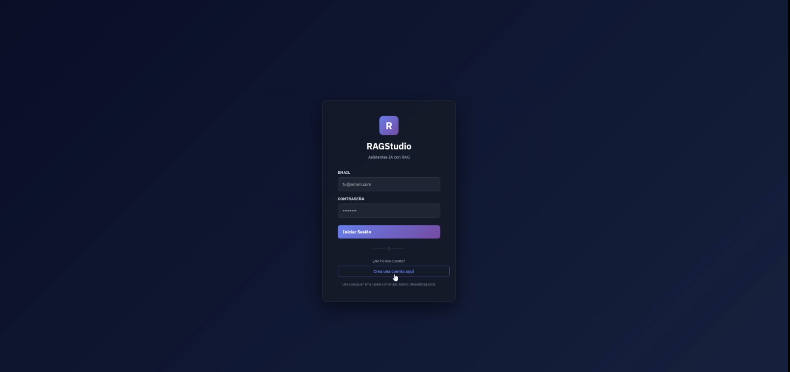
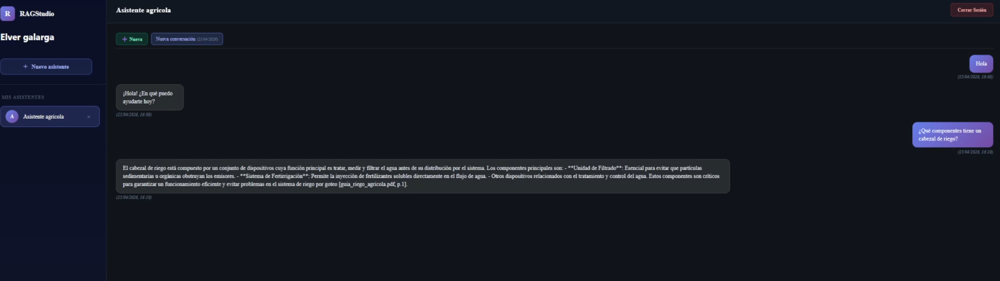
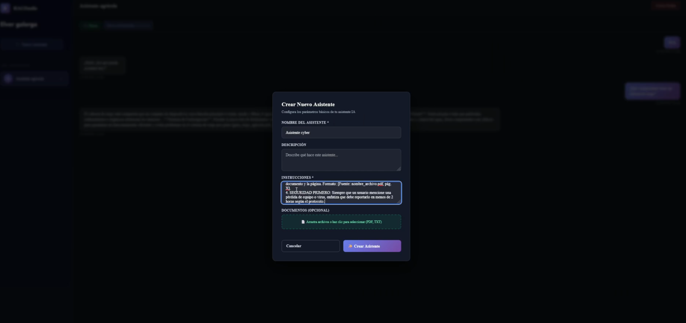

# Resumen del Proyecto: RAG SAAS

Este proyecto se encuentra alojado en el siguiente repositorio: [MarcosCS2004/Practica-RAG-SAAS](https://github.com/MarcosCS2004/Practica-RAG-SAAS)

### Puntos Clave

* **Plataforma SAAS**: Genera asistentes inteligentes especializados mediante RAG, utilizando Azure OpenAI para procesar y responder consultas sobre documentos técnicos cargados.
* **Aislamiento de Información**: Garantiza el aislamiento estricto de información entre diferentes asistentes mediante filtros de metadatos, asegurando que cada uno acceda solo a su base de conocimientos específica.
* **Respuestas Verificadas**: Ofrece respuestas con citas automáticas y memoria de chat persistente, eliminando alucinaciones al restringir la generación de texto exclusivamente al contexto verificado.

---

